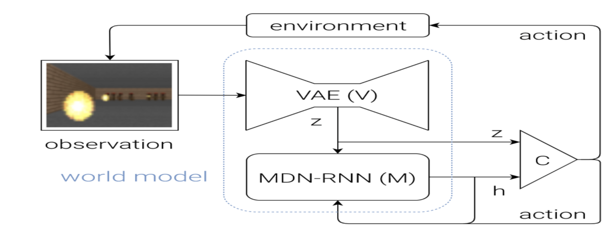

# Shaping-Agent-Imagination
# Core Idea: 
- Create a RL agent that can observe an environment and collect visual observations. 
- Using those visual observations train a Generative model that can predict what the agent can see in k-timesteps ahead by just looking at the current observation(References 1).
# Unity 3D ML agents Environment
- As part of my research work at the Rutgers Machine Learning Lab, I had this fantastic opportunity to work on the Unity3d game development engine. 
- The plan was to create an environment from scratch that contains an agent that can move around. The environment automatically changes to a new view after every episode - an episode ends when the agent completes a defined limit of time steps.
- Unity 3d has been building ML-Agents (https://github.com/Unity-Technologies/ml-agents) for a long time now & aiding research in the domain of Reinforcement Learning.

- Files for the environment is in the Unity folder.
# Data collection
- Our basic idea is to build an agent's ability to visualize what it can see in future k-steps. 
- We need visual data for that. AgentExplorationData notebook will collect observations and save them as .pkl files
# Training
- Used GRU units for time series and convDRAW for encoding the visual representation. ShapingAgentImagination notebook will train the agent.
# References
1. Shaping Belief States with Generative Environment Models for RL by Google Deepmind is an excellent research paper that consistently inspired me to work on this project. The core idea of this repo is taken from the paper.
2. Recurrent World Models Facilitate Policy Evolution by David Ha, Jürgen Schmidhuber is another killer paper. See this link and thank me later :) - https://worldmodels.github.io/ 

3. Unity ML agents examples - https://github.com/Unity-Technologies/ml-agents/blob/master/docs/Learning-Environment-Examples.md
Lots of internet research.
